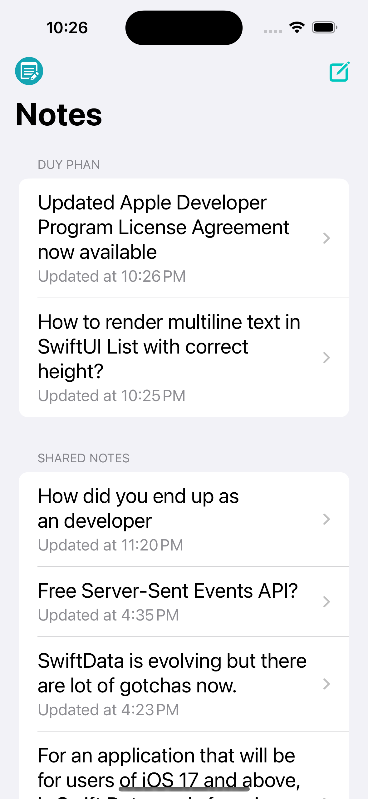
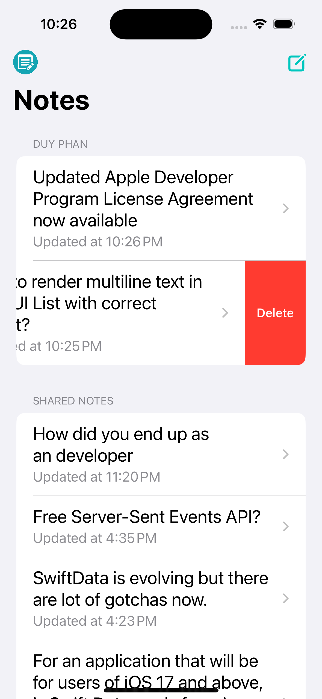

# PAD-Notes
A notes application for iOS, iPadOS. This project is the showcase of MVVM architecture, following SOLID principles, using Firebase Authentication, Firebase Realtime Database and SwiftUI, SwiftCombine, etc.

# Features 
- User: -> spend time: ~10hrs
    + Create with email/ password
    + Login with email/ password
    + Update display name
    
- Note: -> spend time: ~8hrs
    + Create a note
    + Update/ delete a note
    + Listing notes by user
    + Listing shared notes of all User
    
- Unit-Test: 
    + NoteDatabaseModule: -> spend time: ~4hrs
        + Test NotesListDatabaseProtocol
        + Test NotesDetailDatabaseProtocol 
    + SignIn screen: -> spend time: ~1h
        + Test SignInModel
        + Test SignInViewModel
    + SignUp screen: -> spend time: 30mins
        + Test SignUpModel
        + Test SignUpViewModel

# Backlogs
- User:
    + Sign in with Google, Apple, Facebook
    + Update User Photo
    + Input Day of birth

- Note:
    + Support Attributring to display custom font
    + Support Hyperlink
    + Support Image inline
    + Support Comment
    + Group notes by directory
    
- Sharing:
    + Share note with a grant level: 
        + Read only
        + Read and write
        + None
        
- Others:
    + Retouch UI 
    
# Techniques
- SwiftUI: to develop User Interfaces
- SwiftCombine: to bind data
- Grand central Dispatch (GCD): to multithread 
- MVVM architecture: develop application
- Firebase Authentication: to authenticate user by email/ password, Social
- Firebase Realtime database: to store note data
- Quick, Nimble framework: to write UnitTest
- Follow SOLID principles

# Database Schema
Note:
    userId:
        NoteId:
            Title:      // string
            Content:    // string
            createdAt:  // number
            updatedAt:  // number
            isFavorite: // bool
            isShared:   // bool
